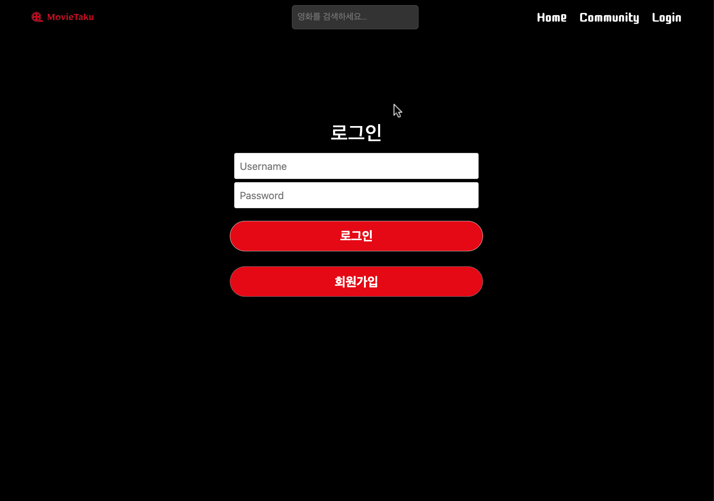
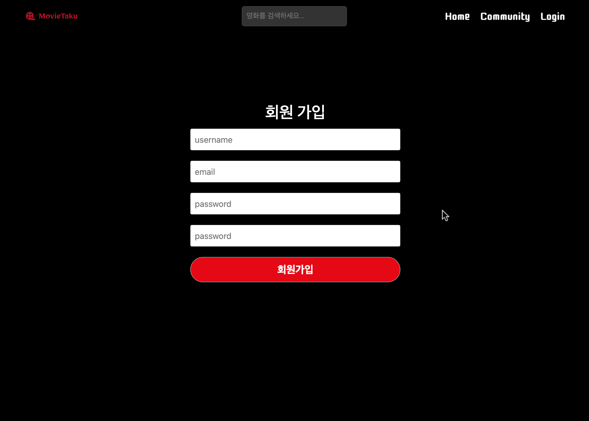
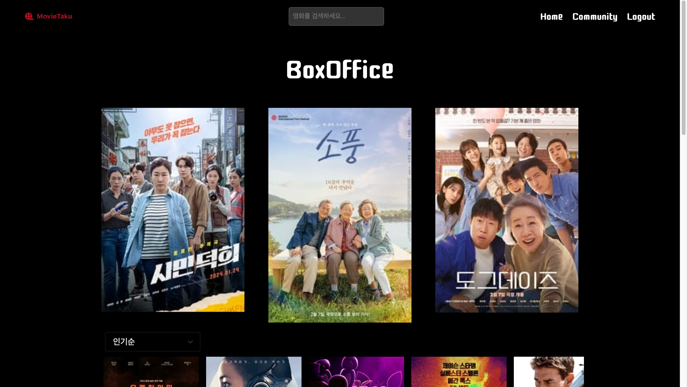
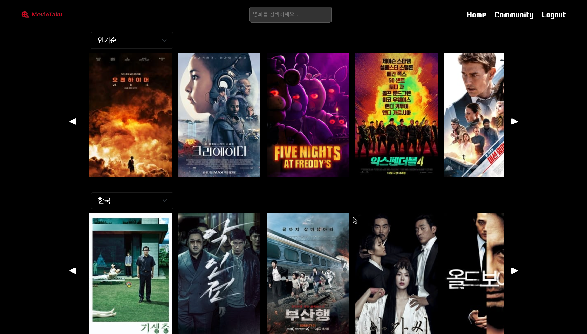
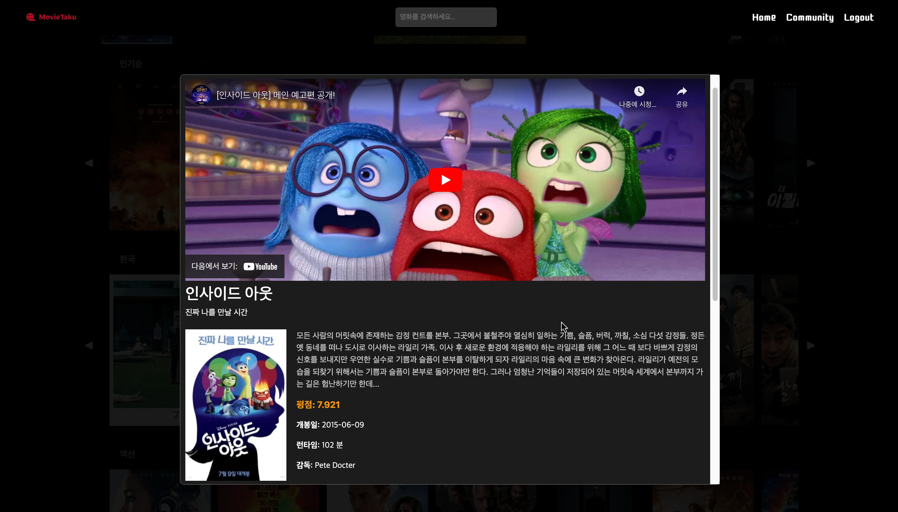
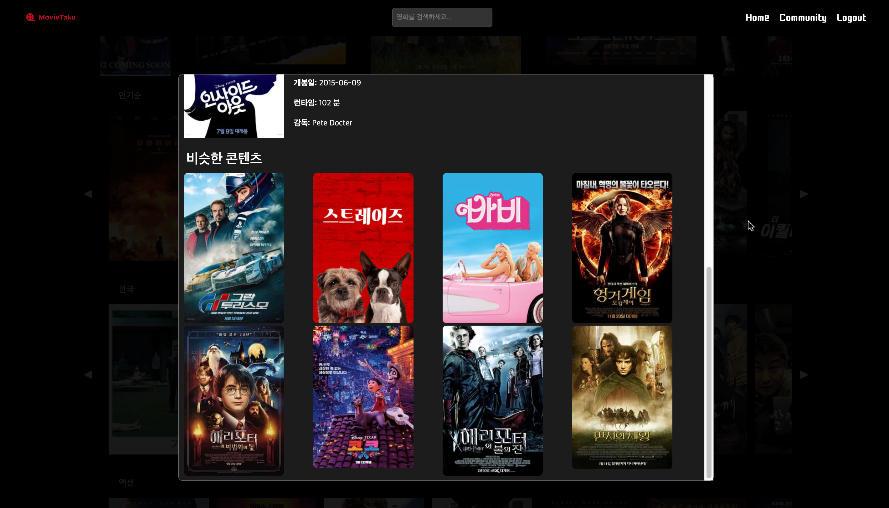
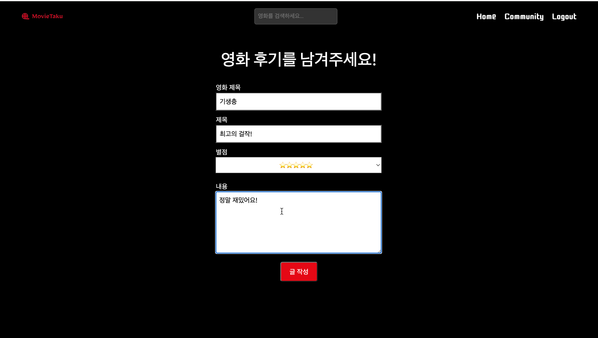
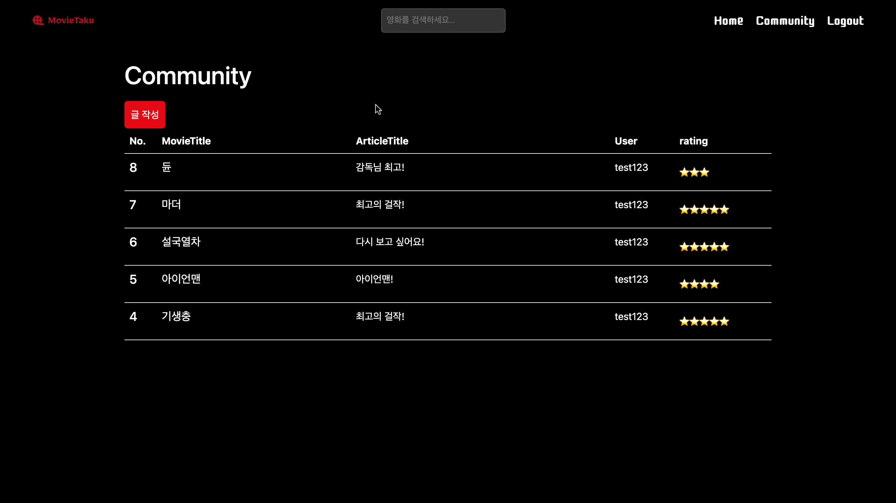

d# MOVIE

 

 

세상의 모든 영화와 함께하다!, <b>MovieTaku</b>

 

## 0️⃣ 프로젝트 목차

- [프로젝트 소개](#1️⃣-프로젝트-소개)
  - [진행 기간](#📆-진행-기간)
  - [배경 및 기능](#📖-배경-기능)
  - [개발 환경](#🛠️-개발-환경)
- [서비스 화면](#2️⃣-서비스-화면)
- [기타](#3️⃣-기타)

## 1️⃣ 프로젝트 소개

### 📆 진행 기간

2023.11.13(월) ~ 2023.11.24(금) 

### 📖 배경 및 기능

어떤 영화를 봐야 할 지 고민하는 사람들을 위한 서비스!

- 자신이 좋아하는 영화를 찾을 수 있는 서비스입니다. 
- 인기, 평점, 나라, 장르, 제작사 등 등 다양한 관점에서 영화를 찾을 수 있어요!
- 자신이 좋아하는 영화와 관련된 비슷한 콘텐츠를 추천받을 수 있어요!
- 커뮤니티를 통해 영화 후기를 남기고 공유할 수 있어요!

### 🛠️ 개발 환경

- Front-End

  - Visual Studio Code 1.85.1
  - Vue 3.3.4
  - Node.js 20.10.0

- Back-End

  - Visual Studio Code 1.85.1
  - Django 4.2.4
  - Python 3.8.10
  - Sqlite

## 2️⃣ 서비스 화면

### 🏠 로그인 및 회원가입

- 화면 중앙의 로그인 버튼을 통해 로그인 또는 회원가입을 진행합니다.
- 로그인을 한 사용자만 서비스를 이용할 수 있습니다.

    
    

### 🌈 메인

- 박스오피스 영화 순위를 실시간으로 볼 수 있어요!
- 인기, 평점, 최신, 개봉 예정인 영화를 선택해서 찾을 수 있어요!
- 나라별, 장르별 영화를 선택해서 찾을 수 있어요!
- 마블, 디즈니, 픽사 등 제조사 별 영화를 찾을 수 있어요!
- 영화의 상세 정보를 볼 수 있어요!
- 선택한 영화와 비슷한 콘텐츠의 영화를 추천 받을 수 있어요!

    
    
    
    

### 📢 커뮤니티 

- 영화 리뷰를 남기고 공유할 수 있어요!

## 3️⃣ 기타